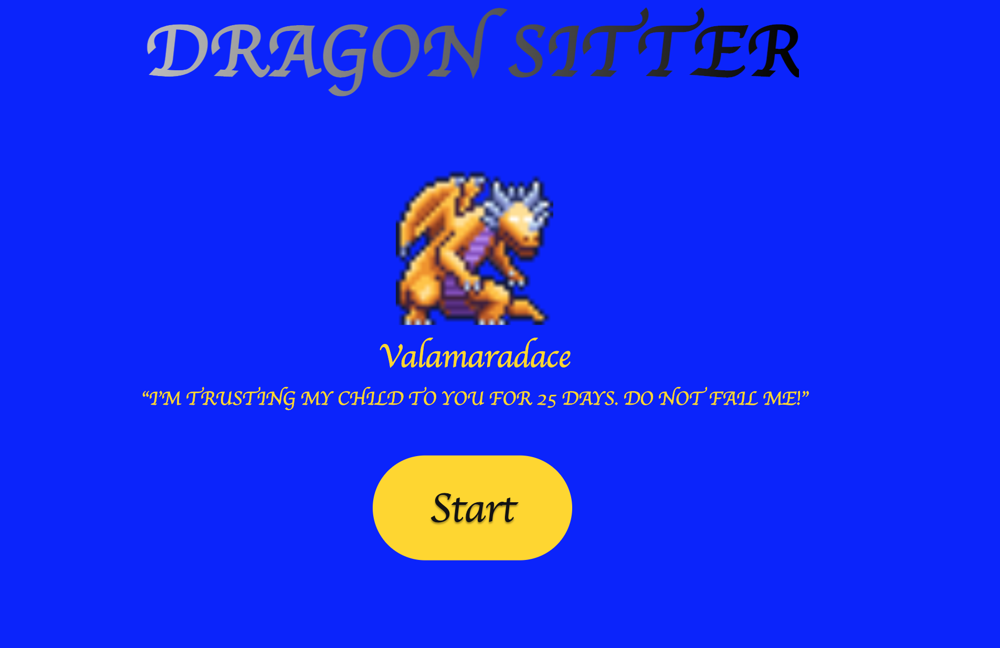
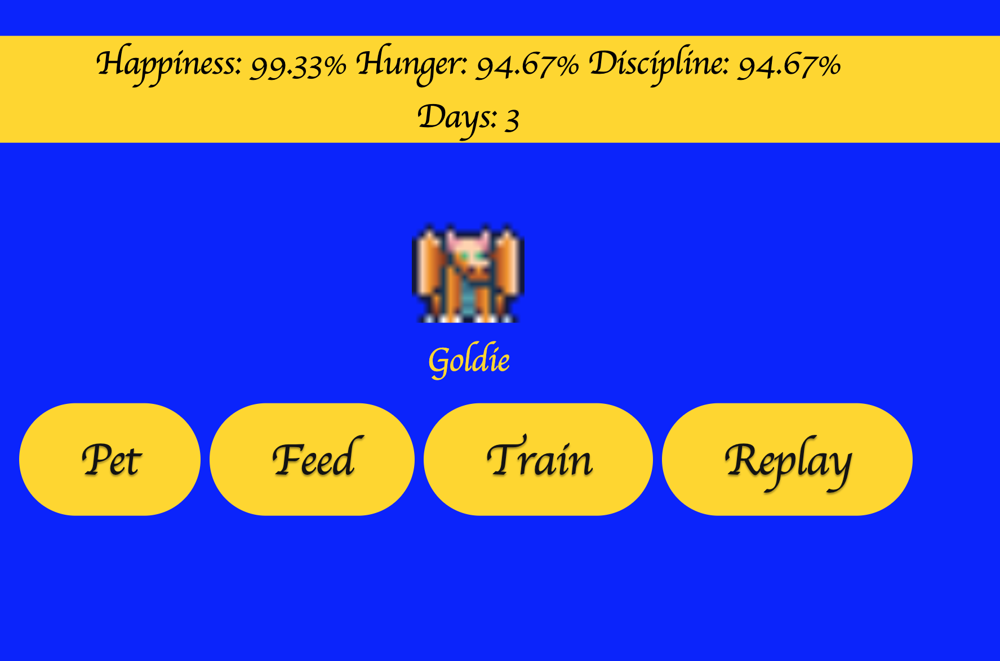
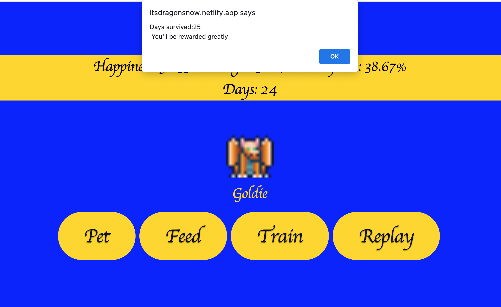
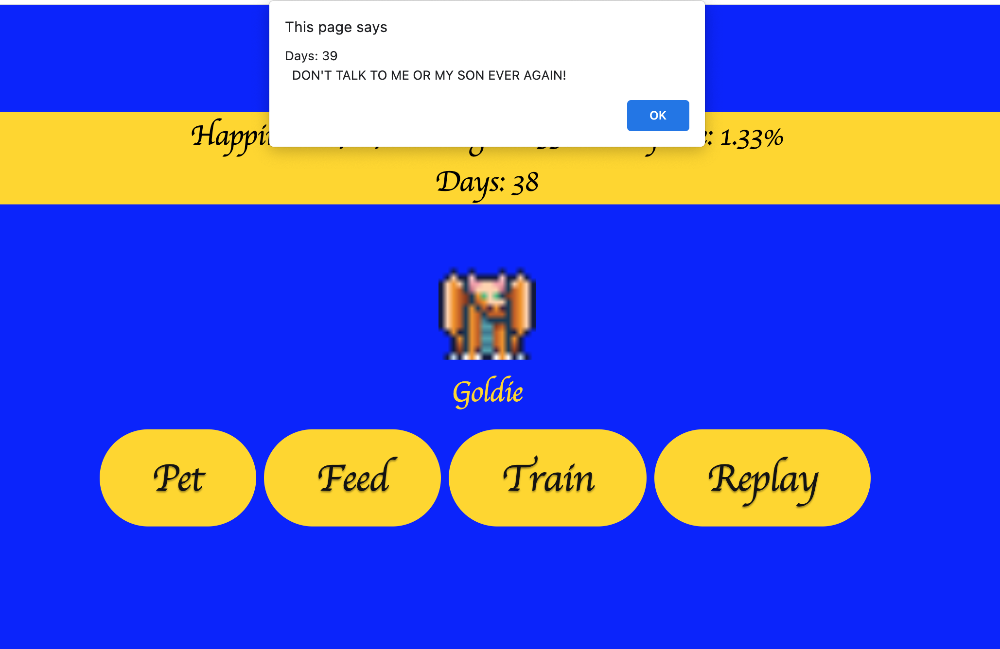

# Dragon Sitter
### Valamaradace, Queen of Dragons, must go and ward off adventurers who have gotten close to finding her vast treasure. She has entrusted you with watching her only child. For how long? 40 or so days probably.

## How to play
### Make sure to Pet Goldie so he stays happy. Make sure to feed him when hungry. Train him so he behaves. Make sure he's healthy when his mom returns!

## Screenshots

## sources
### used html, javascript, css
### googled a ton ending up w3docs, stackoverflow
### googlefonts

### thanks to creators on itch.io:
### music: SVL - https://svl.itch.io/
### sound effects: ObsydianX - https://obsydianx.itch.io/
### sprites: DeepDiveGameStudio - https://deepdivegamestudio.itch.io/
### kristopher helping with interval stuff
### thanks to my teachers
### thank you to my partner who checked on me reguarly through the process. seeing me through my frustration, headbanging, small victories and being sweet about it every single time. making sure i stayed hydrated during this heatwave when I'd forget to eat or drink.

## Here's the game!
https://itsdragonsnow.netlify.app/#

## icebox stuff:
### i want to create what i originally envisioned this game to be. lots of random monsters that grew and evolved over time. more interesting interactions with monsters. really got in over my head when trying to make this game and i thought my initial wireframe was simple and barebones. had all the assets i could want with barely the knowledge on how to use them. i still want to use them

### more dragons, randomized, more monsters in general.
